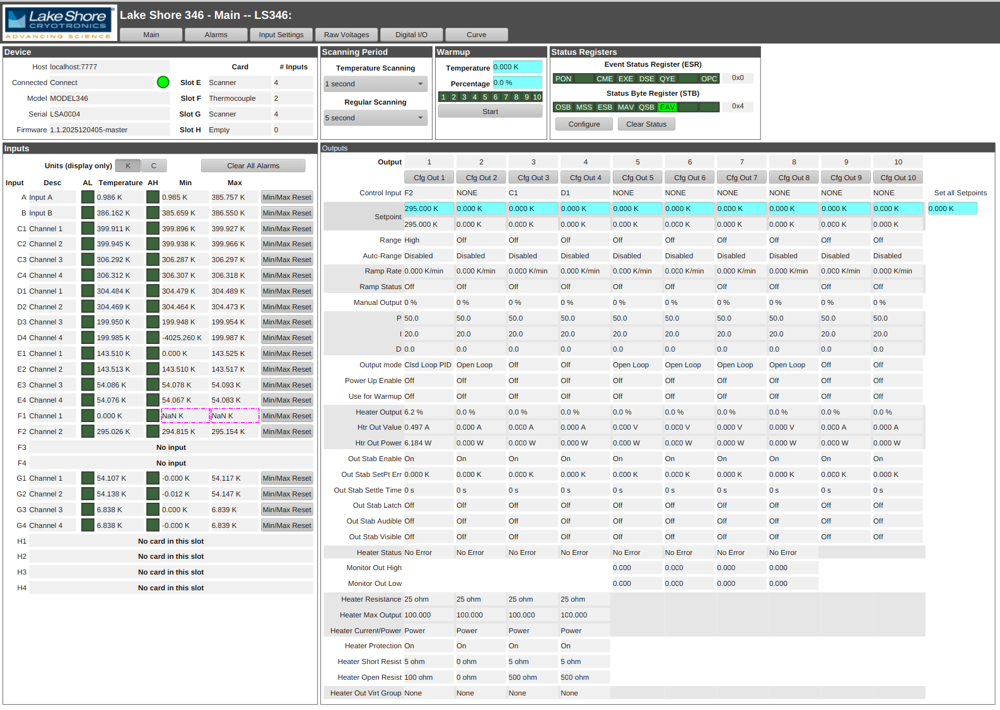

Lake Shore 346
==============

This is an [EPICS](https://epics-controls.org) [StreamDevice](https://paulscherrerinstitute.github.io/StreamDevice) driver for the [Lake Shore](https://www.lakeshore.com/) [Model 346](https://manuals.lakeshore.com/instruments/test/introduction/index.html) controller. This driver is based on Matt Pearson's [Lake Shore 336 EPICS driver](https://github.com/mp49/lakeshore).

Protocol reference: [Model 346 Remote Operation Manual](https://manuals.lakeshore.com/instruments/test/remote_operation/command_reference.html)

## Dependencies

This driver depends on the following EPICS modules

* [calc](https://github.com/epics-modules/calc)
* [asyn](https://github.com/epics-modules/asyn)
* [StreamDevice](https://github.com/paulscherrerinstitute/StreamDevice)

## Operator Interfaces

[Phoebus](https://github.com/ControlSystemStudio/phoebus) opperator screens are available under the `bob/` folder.

The screens are somewhat smart, hiding records for inputs or cards that are not available/not installed on the device.

## Operation

Record names should correspond mostly 1:1 to the 346's protocol commands.

## iocsh functions

A special `lakeshore346_autoload_db` iocsh function is made available to automatically load relevant records based on the current hardware configuration of the 346. This function will probe the device with the `CARDS?` command and will load input records E1 through H4 only for inputs that are actually available.

It is recommended to use this function instead of manually loading individual db files.

## aSub Records

A few [aSub](https://docs.epics-controls.org/projects/base/en/latest/aSubRecord.html) records are available in this IOC to implement trickier features.

### Input Reading

* `$(P)$(R)INPALL:KRDG_FOUT`
  * aSub subroutines: `temp_fanout_init`, `temp_fanout-proc`
  * Purpose: read all temperature readings in Kelvin (`KRDG? ALL` command) and distribute them to the appropriate card inputs, depending on their availability. This is done as an optimization so that one command returns all readings. The temperatures readings will be available in VALA-VALH as follows:
    * `VALA`: an array with a single value, corresponding to the temperature reading for input `A`
    * `VALB`: an array with a single value, corresponding to the temperature reading for input `B`
    * `VALC`: an array with four values, corresponding to the temperature reading for inputs `C1`-`C4`
    * `VALD`: an array with four values, corresponding to the temperature reading for inputs `D1`-`D4`
    * `VALE`: an array with zero to four values, corresponding to the temperature reading for inputs `E1`-`E4` (depending on whether a card is installed in slot E, and which type of card)
    * `VALF`, `VALG`, `VALH` similarly for slots F, G and H

* `$(P)$(R)INPALL:SRDG_FOUT`
  * aSub subroutines: `temp_fanout_init`, `temp_fanout-proc` (same as `KRDG_FOUT`)
  * Purpose: read all raw sensor readings (`SRDG? ALL` command) and distribute them to the appropriate card inputs, in the same way as `SRDG_FOUT`.

### Calibration Curve R/W

* `$(P)$(R)CURVE:READ_ASUB`
  * aSub subroutines: `curve_read_init`, `curve_read_proc`
  * Purpose: read the specified calibration curve into a pair of records (one for the units column, one for the temps column). This issues a series of batched `CRVPT?` commands to obtain each point of the calibration curve.

* `$(P)$(R)CURVE:RESIZE_ASUB`
  * aSub subroutines: `curve_resize_init`, `curve_resize_proc`
  * Purpose: a helper to resize the waveforms holding the curve data. This is useful in order to add or remove points in the calibration curve for later upload.

* `$(P)$(R)CURVE:WRITE_ASUB`
  * aSub subroutines: `curve_write_init`, `curve_write_proc`
  * Purpose: write new data to a calibration curve. This issues a series of batched `CRVPT` commands in order to update the curve's data on the device.
